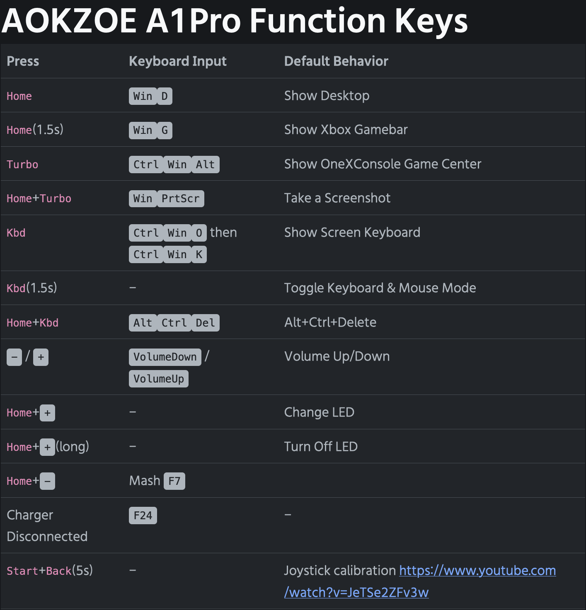

# The unofficial AOKZOE A1 Pro User Guide

   

# Unofficial user guide for the AOKZOE A1 Pro handheld computer

Hi, and welcome to the unofficial user guide for the AOKZOE A1 Pro handheld computer! This guide contains essential information to get you started, do's and don'ts as well as essential reading material and online communities. Always a work in progress, so feel free to raise issues, or better yet: pull requests if you think someting should be changed or added.

## Contents

## Day-1 user guide

### Things you should never do

* NEVER install the A1 (AMD Ryzen 7 6800U) BIOS on the A1 Pro (AMD Ryzen 7 7840U). Different platform, may brick your device. Same for vice versa.

### Things you should always do

* Always check the [Official AOKZOE and community Discord](https://t.co/l34hV0bSfA), it has the latest updates/news, direct access to AOKZOE and a very competent community.

## Troubleshooting

Common issues and fixes will be put here.

## Tricks and tips

### Remapping hotkeys

See below picture for an overview of the configured hotkeys and how they map to the buttons on the A1 Pro. You can use a tool such as [Powertoys](https://learn.microsoft.com/en-us/windows/powertoys/keyboard-manager) to remap them if needed.

   

### Fresh Windows 11 installations

If you replaced the SSD or just want to do a fresh Windows 11 installation, you might end up spending a lot of time collecting all the required device drivers for graphics, audio, accellerometer, etc. You can save a lot of time by using the 'Driver archive' from the links section. This contains all the necessary drivers. From Device Manager, select the top level element (name of your device) and right click it, then select 'install drivers'. It will take a few minutes and afterwards everything will be there. Reboot and you're all good to go.

## Essential links

* [Official AOKZOE and community Discord](https://t.co/l34hV0bSfA)
* [Official AOKZOE A1 Pro driver package](https://1drv.ms/u/s!AilYUA_Au4xWz1W3_hSXO0i2xZHs?e=2ZD15s)
* [Official AOKZOE website](https://aokzoestore.com/)
* [Indiegogo campaign for the A1 Pro](https://www.indiegogo.com/projects/aokzoe-a1pro-world-s-1st-7840u-gaming-handheld#/)
* [GBATemp forum for the AOKZOE A1 Pro](https://gbatemp.net/forums/aokzoe-a1-pro.657/)

## Useful utilities and apps

* [Replace the legacy Windows on-screen keyboard (ReplaceOSK)](https://github.com/Lulech23/ReplaceOSK)
* [Handheld Control Panel](https://github.com/project-sbc/Handheld-Control-Panel/releases/tag/1.0.0.0)
* [Motion Assistant with 7840U support](https://www.mediafire.com/file/t1i783hyspu4wwz/MotionAssistant_1162.zip/file)
* [Driver archive with every A1 Pro driver one could possibly need](https://mega.nz/file/TVxAwLzA#QutamkUqTFG8rOHeGcQwPidjfqIGTdCb1EWCjFbLbSc)
* [OneXConsole 0.5.11](https://aokzoe.oss-cn-hangzhou.aliyuncs.com/a1_drivers/OneXConsole_0.5.11.exe)
* [Unofficial community drivers for the 7840U](https://gbatemp.net/forums/aokzoe-a1-pro.657/)

## Reviews

[James Techjackin' Jackson A1 Pro Review](https://www.youtube.com/watch?v=FQyrs-rVxp0)

## Disclaimers

Use any information in this guide or linked from this guide at your own risk. It's perfectly possible to brick your device by tinkering with BIOS or other settings and opening it up can totally damage it physically. Do so at your own risk.