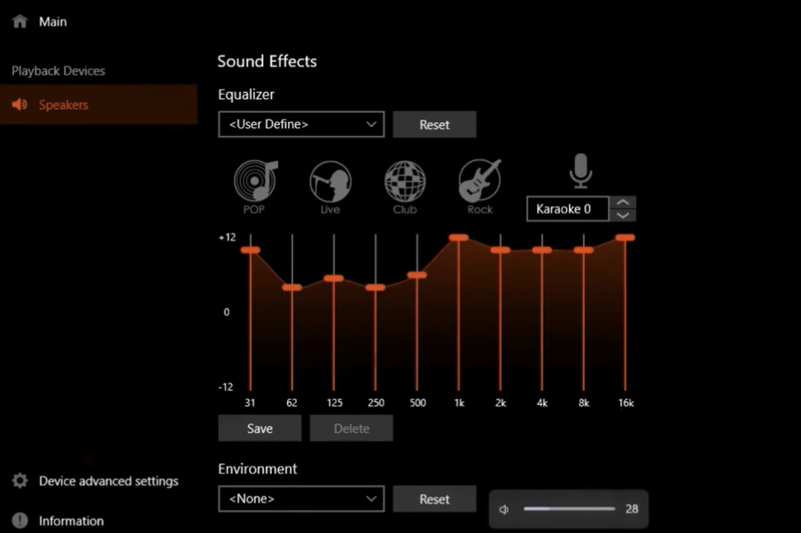

** Realtek Audio Console EQ settings for better sound on inbuild Speakers from A1 Pro **

If you want to enhance the sound of the onboard speakers, but don't want to add another tool such as FXSound, you can also configure the EQ on the Realtek Audio Console. The console comes with the audio drivers and should already be on your A1 Pro.

1. Uninstall FXSound or any other EQ/processing tools (or disable them for the Realtek Speakers via the `Sound` menu in `Settings`).
1. Search for `Realtek Audio Console` in the Windows search bar and run it. 
1. Go to `Output`. This is where you can set and change the EQ. Follow the steps in ["https://youtu.be/MUhOurDx2fQ](this video) for the best settings on the A1 Pro.
1. Save the profile.
1. Your settings should look roughly like the image below.

   

Another video that explains how to enhance the sound using the Realtek Audio Console by James Techjackin' Jackson: [link](https://youtu.be/38FY-ULtYQY)
